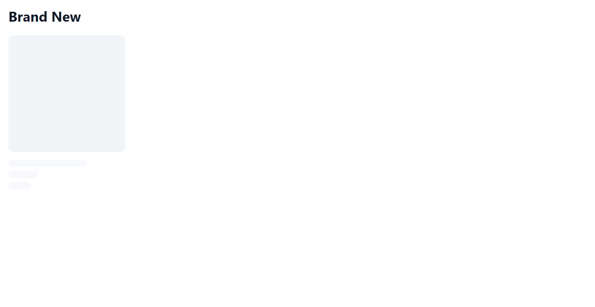
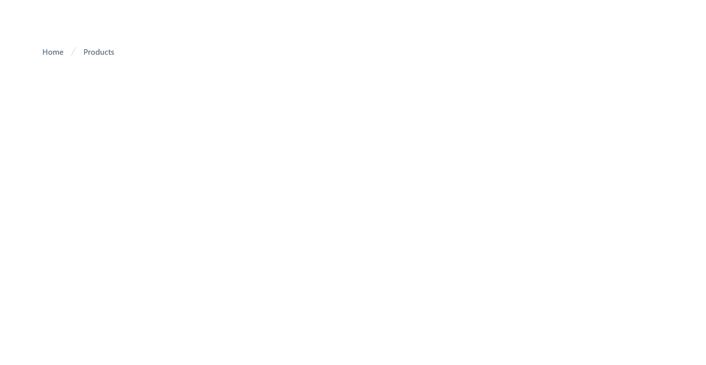
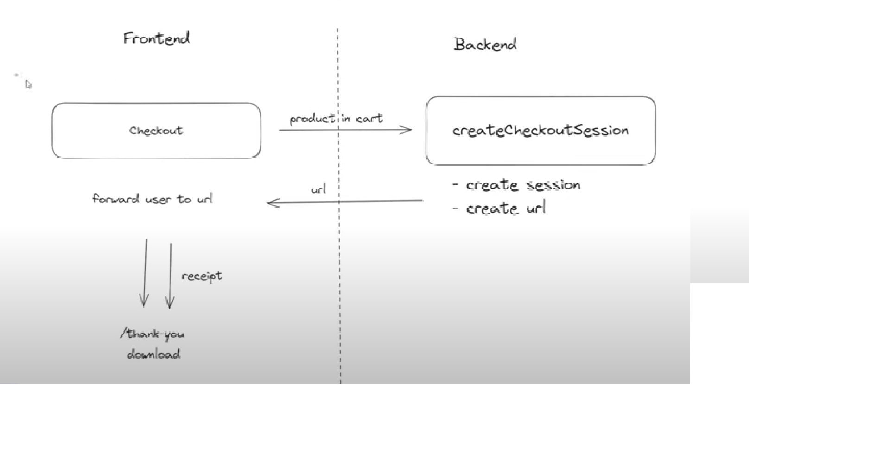
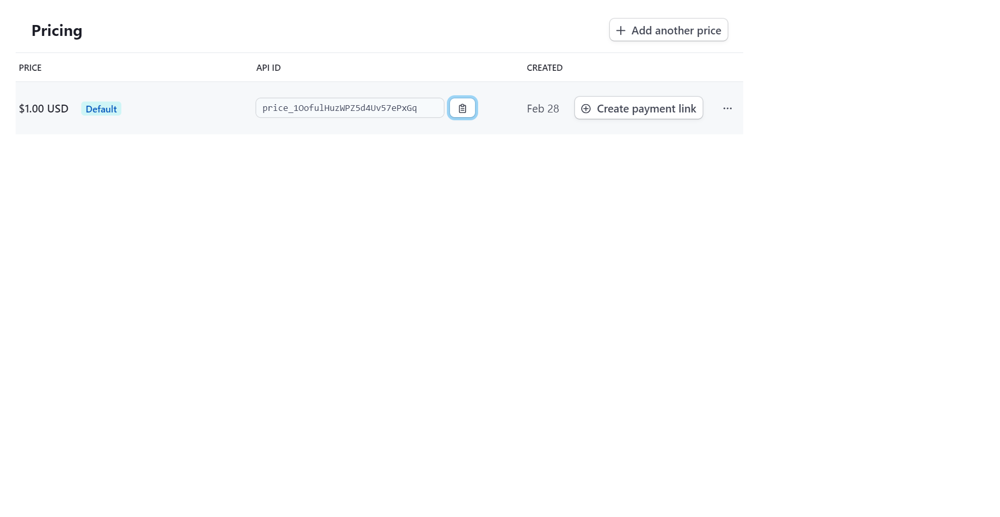
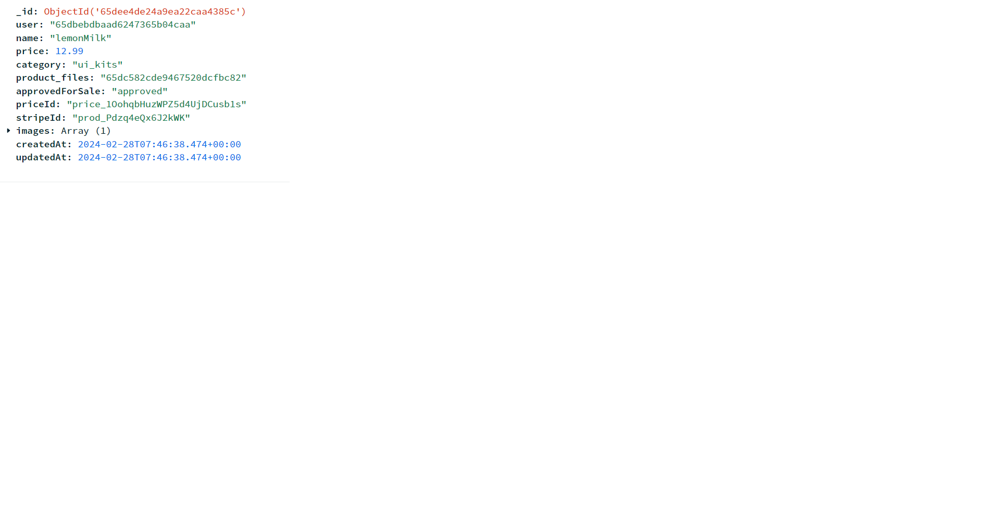
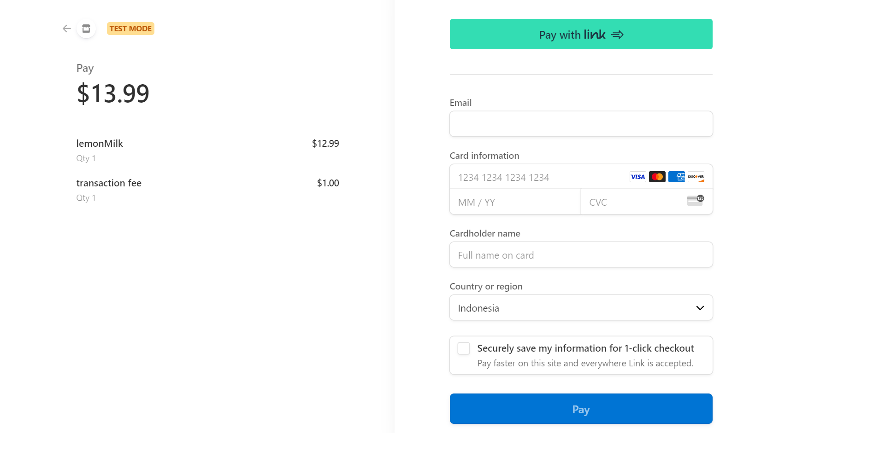
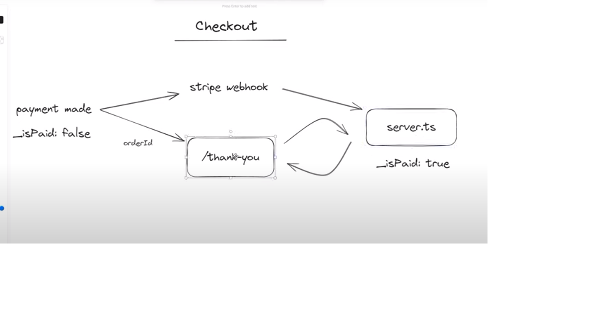
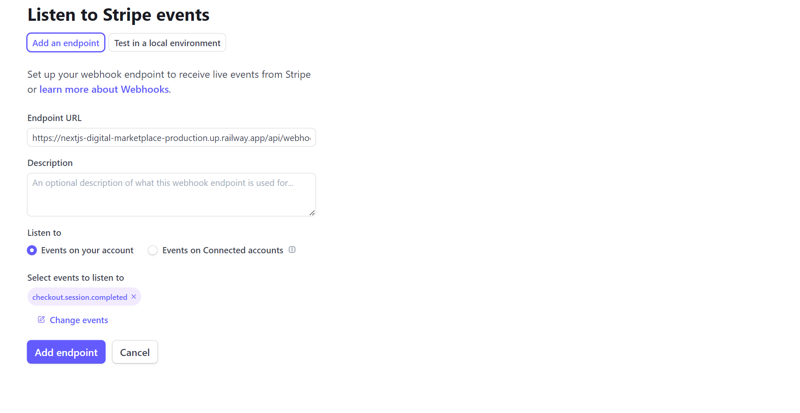

## showing products in store -------------------------------------------------------------------
## 1. CREATE NEW COMPONENT component > ProductReel.tsx

## 2. CREATE MAIN ROUTER IN trpc > index.ts (getInfiniteProducts)
 - infinite bcs we're going to do an infinite query to get more and more producs

## 3. CREATE NEW VALIDATOR METHOD lib > validator > query-validator.ts
 - to make sure the user can only filter by fields that we allowed to prevent abuse of our API

##  4. CREATE NEW COMPONENT components > ProductListing.tsx
 - npx shadcn-ui@latest add skeleton

##  5. RESULT: LOADING STATE OF PRODUCT <ProductPlaceholder />

 

## AirBnB-style image slider ----------------------------------------------------------------------

## 1. CREATE NEW COMPONENT components > ImageSlider (For AirBnB image slider)
 - npm i swiper (for sliding functionality)

## 2. NEXTJS CONFIG : FOR AUTHORIZE IMAGE FROM FILE SYSTEM

```ts
const nextConfig = {
  // ----------------------  start
  images: {
   remotePatterns: [
      {
        hostname: 'localhost',
        pathname: '**',
        port: '3000',
        protocol: "http"
      }
    ]
  }
  // ---------------------- end
}

```
## 7:45:24 - product detail page   ---------------------------------------------------


## 1. CREATE NEW ROUTE > product > [productId] > page.tsx
 - imported ProductReel.tsx

## 2. RESULT : BreadCrums



## 3. CREATE NEW COMPONENT  components > AddToCartButton.tsx
 - would be imported to product > [productId] > page.tsx


## 8:13:16 - persist shopping cart logic ----------------------------------------------------------

## 4. CREATE CUSTOM HOOK FOR CART hook > use-cart.ts
 - npm i zustand 

## 5. ADD LOGIC TO Cart.tsx COMPONENT 8.24
 - npx shadcn-ui@latest add scroll-area

 ```tsx
      const { items } = useCart() // from custom hook
      const itemCount = items.length

      const cartTotal = items.reduce( // for total price
        (total, { product }) => total + product.price,
        0
      )


       {/* cart logic */}
              <ScrollArea>
                {items.map(({ product }) => (
                  <CartItem
                    product={product}
                    key={product.id}
                  />
                ))}
              </ScrollArea>
 ```

## 6. CREATE NEW COMPONENT component > CartItem.tsx
 - imported to Cart.tsx


## 8:40:47 - checkout page  -----------------------------------------------------------------------

## 1. CREATE NEW ROUTE cart > page.tsx 8.59.13

## 2. WHAT HAPPEND WHEN USER CLICK CHECKOUT BUTTON

 


## 3. CREATE tRPC ROUTER trpc > payment-router.ts

## 9:20:23 - Protecting our API with secured routes -----------------------------------------------------

## 1. CREATE MIDDLEWARE IN trpc > trpc.ts

```ts
    const middleware = t.middleware

    const isAuth = middleware(async ({ ctx, next }) => { // to check is user has logged in or not
      const req = ctx.req as PayloadRequest

      const { user } = req as { user: User | null }

      if (!user || !user.id) {
        throw new TRPCError({ code: 'UNAUTHORIZED' })
      }

      return next({
        ctx: {
          user,
        },
      })
    })


    export const privateProcedure = t.procedure.use(isAuth) // .use() same like express middleware
```

## 9:24:41 - Creating the user checkout sessions  ----------------------------------------------------

## 1. CREATE CHECKOUT SESSION IN trpc > payment-router.ts

## 2. CREATE LIB > stripe.ts (for checkout session ) 
 - npm i stripe (stripe for checkout session)

## 3. GET STRIPE SECRET KEY FROM STRIPE WEBSITE
 - and copy it to .env

## 4. STRIPE WEBSITE: product catalog > create a product > save (for stripe pricing API ID)



## 5. CREATE BeforeCheck HOOK in collections > Product > Product.ts
 - beforeChange hooks will run within create and update
 - beforeChange hook to get notified when product is created

## 6. IMPORT STRIPE SESSION TO CHECKOUT PAGE (cart > page.tsx) 

```tsx
      const { mutate: createCheckoutSession, isLoading } = // stripeSession
        trpc.payment.createSession.useMutation({
          onSuccess: ({ url }) => {
            if (url) router.push(url)
          },
        })

        const productIds = items.map(({ product }) => product.id)

        // in button
      <Button
        onClick={() =>
                  createCheckoutSession({ productIds })
                }
                className='w-full'
                size='lg'>
               
                Checkout
      </Button>
```
## 7. IN ADMIN DASHBOARD DELETE PREVIOUS PRODUCT AND RECREATE IT IN ORDER TO GET StripeId IN PRDODUCT

  - we get stripeId and priceId from stripe

  

## 8. RESULT : PAYPAL STILL UNAVAILABLE



## 9:55:27 - How does our payment flow look like? -----------------------------------------------


 - infinite request happent if isPaid=false

## 9:57:57 - Creating the thank-you page  ---------------------------------------------------------

## 1. CREATE NEW ROUTE app > thank-you > page.tsx

## 2. CREATE NEW COMPONENT components > PaymentStatus.tsx
 - imported to  thank-you > page.tsx

## 3. CREATE NEW PAYMENT API ROUTE ( pollOrderStatus )

## 10:39:16 - Listening for stripe webhook locally ------------------------------------------------
 - we will work on the way stripe webhook nogifying us that the order payment is successful


##  1. CREATE WEBHOOK MIDDLEWARE IN servet.ts
 - npm i body-parser ( will allow us to receive a proper notification from stripe )

## 2. CREATE CUSTOM FUNCTION src > webhook.ts (for stripe webhook handler)

## 10:47:05 - Creating the receipt email  ----------------------------------------------

## 1. CREATE COMPONENT component > emails > ReceiptEmail.tsx
 - this component is imported to webhook.ts

 - email html template from : demo.react.email
 - npm i @react-email/component (to use html template)
 - npm i date-fns (for date formating)

 ## 10:54:47 - Deployment to receive webhook in production ----------------------------------

## 1. npm run lint TO FIND ANY POTENTIAL CODE ISSUE
 - very important to deployment

## 2. CREATE package.json build SCRIPT

```json

 "build:payload": "cross-env PAYLOAD_CONFIG_PATH=src/payload.config.ts payload build",  // create payload as first step
    "build:server": "tsc --project tsconfig.server.json",  // create server as second step
    "build:next": "cross-env PAYLOAD_CONFIG_PATH=dist/payload.config.js NEXT_BUILD=true node dist/server.js", // build nexjs as third steps
    "build": "cross-env NODE_ENV=production yarn build:payload && yarn build:server && yarn copyfiles && yarn build:next",  // combining all 3 steps
    "start": "cross-env PAYLOAD_CONFIG_PATH=dist/payload.config.js NODE_ENV=production node dist/server.js",  // start the built version
    "copyfiles": "copyfiles -u 1 \"src/**/*.{html,css,scss,ttf,woff,woff2,eot,svg,jpg,png}\" dist/",
```
## 3. CHANGE IN tsconfig 
 - from : 
  "moduleResolution": "bundler",
  "module": "esnext",
 - to :  
 "moduleResolution": "node",
  "module": "commonJS",

## 4. npm i -D copyfiles
 - to copy ovel the static files of project

## 5. CREATE SCRIPT SERVER FOR PRODUCTION VERSION IN server.ts

```ts
    if (process.env.NEXT_BUILD) {
        app.listen(PORT, async () => {
          payload.logger.info(
            'Next.js is building for production'
          )

          // @ts-expect-error
          await nextBuild(path.join(__dirname, '../'))

          process.exit()
        })

        return
      }
```
## 6. DEPLOY THE PROJECT AT railway.app (pust project to github first)
 - configure env and new url

## 7. CREATE WEBHOOK AT stripe 
 - create new endpoint api
   https://nextjs-digital-marketplace-production.up.railway.app/api/webhook/stripe
 - select events to send: checkout.session.completed

 

## 8. DEPLOYMENT DEBUGGING 

8. 1. at package.json
   "main": "dist/server.ts",

     "resolutions": {
    "cliui": "7.0.2"
  },

8. 2. copy signing secret to .env files
 STRIPE_WEBHOOK_SECRET=
 - also copy to railway.app

## 11:10:44 - Final security tweaks ---------------------------------------------------


## 1. PROTECT cart PAGE AT server.ts (create middleware for cart page)

```ts

      // security for cart page
      const cartRouter = express.Router()

      cartRouter.use(payload.authenticate)  // must authenticated

      cartRouter.get('/', (req, res) => {
        const request = req as PayloadRequest

        if (!request.user)
          return res.redirect('/sign-in?origin=cart')

        const parsedUrl = parse(req.url, true)
        const { query } = parsedUrl

        return nextApp.render(req, res, '/cart', query)
      })

      app.use('/cart', cartRouter)
```
 
## 2. CREATE NEXTJS MIDDLEWARE src > middleware.ts
 - if user already login it can access sign-in and sign-up page

## 3. UPDATE AT collections > User.ts


-  ADD PRODUCT FIELDS AT USER PRODUCT COLLECTION FOR DATA INTEGRITY (collections > User.ts)
    {
    name: 'products',
    label: 'Products',
    admin: {
      condition: () => false,
    },
    type: 'relationship',
    relationTo: 'products',
    hasMany: true,
  },

- CONFIGURE ACCESS
 - // the one who can see user is admin and currently login user
```ts
 const adminsAndUser: Access = ({ req: { user } }) => { // the one who can see user is admin and currently login user
  if (user.role === 'admin') return true

  return {
    id: {
      equals: user.id,
    },
  }
}
```

- MODIFY GENERATE EMAIL
```ts
    generateEmailHTML: ({ token }) => {
              return PrimaryActionEmailHtml({
                actionLabel: "verify your account",
                buttonText: "Verify Account",
                href: `${process.env.NEXT_PUBLIC_SERVER_URL}/verify-email?token=${token}`
              })
            },
```


## 4. CREATE NEW COMPONENT FRO VERIFICAITON EMAIL > components > email > PrimaryActionEmail.tsx
 - this components is imported to collections > User.ts

## 5. UPDATE AT collections > Products > Products.ts
 5. 1. DATA INTEGRITI sync to user when new product is created
   - syncUser()

5. 2. MODIFY ACCESS POLICY

```ts
  access: {
    read: isAdminOrHasAccess(),
    update: isAdminOrHasAccess(),
    delete: isAdminOrHasAccess(),
  },
```

### note: everytime we modify collection fields we should run generate:types to update typescript types

## 11:36:08 - Final styling tweaks --------------------------------------------------------------------

## 1. CREATE NEW ROUTE products > page.tsx  


## 2. CREATE COMPONENT components > Footer.tsx
 - imported to layout.tsx 

## 3. CREATE COMPONENT components > MobileNav.tsx
 - imported to Navbar.tsx

##  4. FIX METADATA OF PAGE IN lib > utils.ts
 - create constructMetadata() => use in layout.tsx

## 5. CHANGE NEXTJS CONFIG TO IMAGE
 - from :
   remotePatterns: [
       {
         hostname: 'localhost',
         pathname: '**',
         port: '3000',
         protocol: "http"
       }
     ]

 - to :
    domains: [
      'localhost',
      'nextjs-digital-marketplace-production.up.railway.app'
    ]
## 
## 